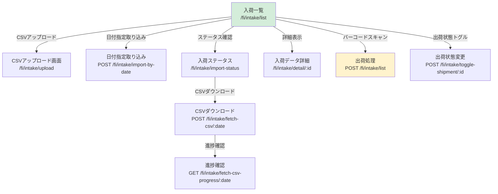
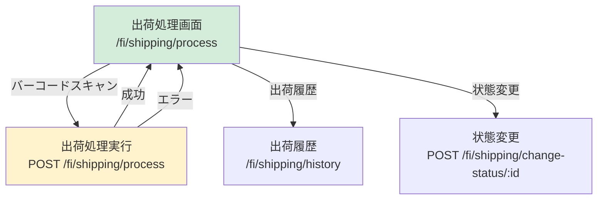
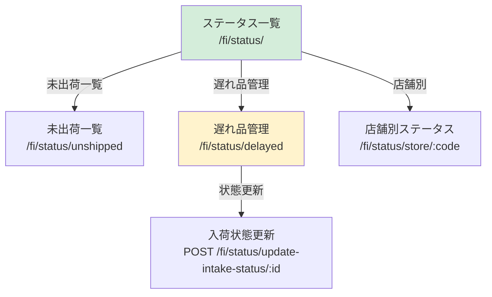
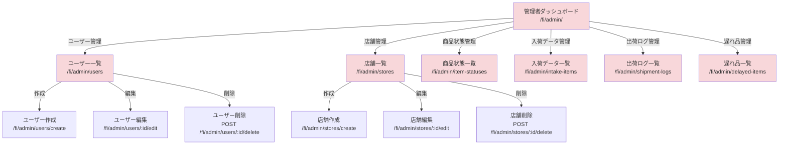
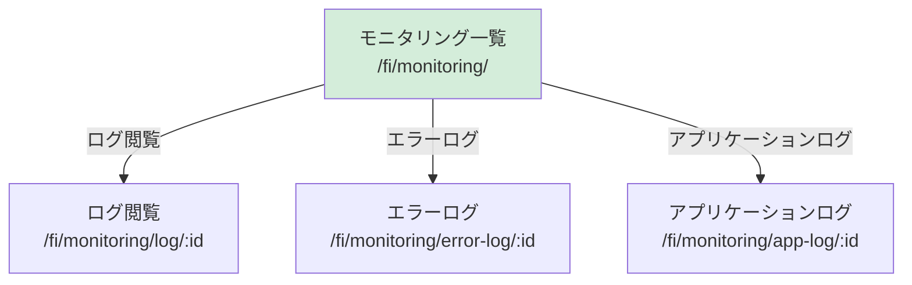
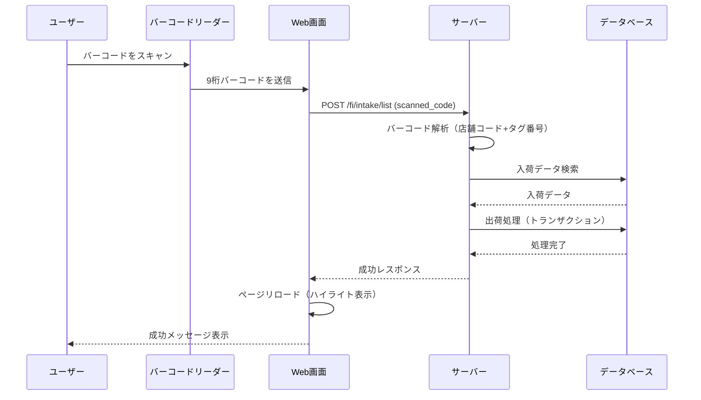
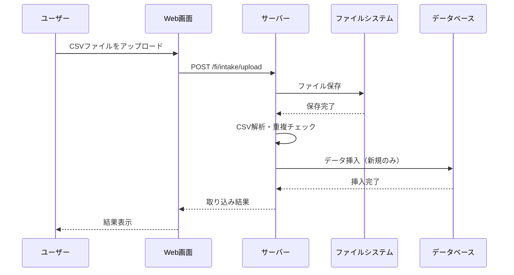

# 画面遷移図

新・出荷システムの画面遷移図です。

## 全体遷移図

```mermaid
graph TB
    Start([開始]) --> Login[/fi/auth/login<br/>ログイン画面]
    Login -->|ログイン成功| Dashboard[/fi/<br/>ダッシュボード]
    
    Dashboard --> IntakeList[/fi/intake/list<br/>入荷一覧]
    Dashboard --> ShippingProcess[/fi/shipping/process<br/>出荷処理]
    Dashboard --> StatusUnshipped[/fi/status/unshipped<br/>未出荷一覧]
    Dashboard --> Monitoring[/fi/monitoring/<br/>モニタリング]
    Dashboard --> Admin[/fi/admin/<br/>管理者ダッシュボード]
    
    IntakeList --> IntakeDetail[/fi/intake/detail/:id<br/>入荷データ詳細]
    IntakeList --> IntakeUpload[/fi/intake/upload<br/>CSVアップロード]
    IntakeList --> IntakeImportStatus[/fi/intake/import-status<br/>入荷ステータス]
    
    ShippingProcess --> ShippingHistory[/fi/shipping/history<br/>出荷履歴]
    
    StatusUnshipped --> StatusDelayed[/fi/status/delayed<br/>遅れ品管理]
    StatusUnshipped --> StatusByStore[/fi/status/store/:code<br/>店舗別ステータス]
    
    Monitoring --> MonitoringLog[/fi/monitoring/log/:id<br/>ログ閲覧]
    
    Admin --> AdminUsers[/fi/admin/users<br/>ユーザー管理]
    Admin --> AdminStores[/fi/admin/stores<br/>店舗管理]
    Admin --> AdminItemStatuses[/fi/admin/item-statuses<br/>商品状態管理]
    Admin --> AdminIntakeItems[/fi/admin/intake-items<br/>入荷データ管理]
    Admin --> AdminShipmentLogs[/fi/admin/shipment-logs<br/>出荷ログ管理]
    Admin --> AdminDelayedItems[/fi/admin/delayed-items<br/>遅れ品管理]
    
    Login -->|ログアウト| Logout[/fi/auth/logout<br/>ログアウト]
    Logout --> Login
    
    style Start fill:#e1f5ff
    style Login fill:#fff3cd
    style Dashboard fill:#d4edda
    style Admin fill:#f8d7da
```

## 認証フロー

```mermaid
graph LR
    A[未認証] -->|アクセス| B[/fi/auth/login]
    B -->|ログイン成功| C[認証済み]
    C -->|ログアウト| A
    C -->|アクセス| D[各種機能画面]
    D -->|認証チェック| C
```

## 入荷機能フロー



## 出荷機能フロー



## ステータス確認フロー



## 管理者機能フロー



## モニタリング機能フロー



## 主要な画面遷移パターン

### 1. ログイン → ダッシュボード → 各機能

```
ログイン画面
  ↓ (ログイン成功)
ダッシュボード
  ↓ (メニュー選択)
各機能画面（入荷一覧、出荷処理、ステータス確認など）
```

### 2. 入荷一覧 → 出荷処理

```
入荷一覧画面
  ↓ (バーコードスキャン)
出荷処理実行（POST）
  ↓ (成功)
入荷一覧画面（リロード、ハイライト表示）
```

### 3. 出荷処理 → 出荷履歴

```
出荷処理画面
  ↓ (出荷処理実行)
出荷履歴画面
  ↓ (履歴確認)
出荷処理画面（戻る）
```

### 4. 管理者機能のCRUD操作

```
一覧画面
  ↓ (作成ボタン)
作成画面
  ↓ (保存)
一覧画面（リロード）
  ↓ (編集リンク)
編集画面
  ↓ (更新)
一覧画面（リロード）
  ↓ (削除ボタン)
削除確認
  ↓ (削除実行)
一覧画面（リロード）
```

## 権限による画面アクセス制御

```mermaid
graph TB
    A[未認証ユーザー] -->|アクセス可能| B[/fi/auth/login]
    A -->|アクセス不可| C[その他すべての画面]
    
    D[認証済みユーザー] -->|アクセス可能| E[一般機能画面]
    E --> E1[入荷一覧]
    E --> E2[出荷処理]
    E --> E3[ステータス確認]
    E --> E4[モニタリング]
    
    F[管理者ユーザー] -->|アクセス可能| G[管理者機能画面]
    G --> G1[ユーザー管理]
    G --> G2[店舗管理]
    G --> G3[商品状態管理]
    G --> G4[入荷データ管理]
    G --> G5[出荷ログ管理]
    G --> G6[遅れ品管理]
    
    F -->|アクセス可能| E
    
    style A fill:#ffcccc
    style D fill:#ccffcc
    style F fill:#ccccff
```

## バーコードスキャン処理フロー



## CSV取り込み処理フロー



## 画面一覧（URL別）

### 認証関連
- `/fi/auth/login` - ログイン画面
- `/fi/auth/logout` - ログアウト
- `/fi/auth/profile` - プロフィール
- `/fi/auth/change_password` - パスワード変更

### メイン機能
- `/fi/` - ダッシュボード（ホーム画面）
- `/fi/dashboard` - ダッシュボード
- `/fi/features` - 機能一覧ページ
- `/fi/set-operator` - 担当者設定（API）

### 入荷機能
- `/fi/intake/` - 入荷データ一覧（旧）
- `/fi/intake/list` - 入荷一覧画面（メイン）
- `/fi/intake/upload` - CSVアップロード画面
- `/fi/intake/detail/<item_id>` - 入荷データ詳細
- `/fi/intake/import-status` - 入荷ステータス確認
- `/fi/intake/toggle-shipment/<item_id>` - 出荷状態トグル（API）
- `/fi/intake/fetch-csv/<date_str>` - CSVダウンロード・取り込み（API）
- `/fi/intake/fetch-csv-progress/<date_str>` - CSVダウンロード進捗（API）
- `/fi/intake/<item_id>/history` - 入荷アイテム履歴（API）

### 出荷機能
- `/fi/shipping/` - 出荷スキャン画面
- `/fi/shipping/process` - 出荷処理画面（メイン）
- `/fi/shipping/history` - 出荷履歴
- `/fi/shipping/scan` - バーコードスキャン処理（API）
- `/fi/shipping/change-status/<item_id>` - 商品状態変更（API）

### ステータス確認機能
- `/fi/status/` - ステータス一覧（ダッシュボード）
- `/fi/status/unshipped` - 未出荷一覧
- `/fi/status/delayed` - 遅れ品管理
- `/fi/status/store/<store_code>` - 店舗別ステータス
- `/fi/status/update-intake-status/<item_id>` - 入荷状態更新（API）

### モニタリング機能
- `/fi/monitoring/` - モニタリング一覧
- `/fi/monitoring/log/<job_index>` - ログ閲覧
- `/fi/monitoring/error-log/<job_index>` - エラーログ閲覧
- `/fi/monitoring/app-log/<log_index>` - アプリケーションログ閲覧

### 管理者機能（管理者権限必須）
- `/fi/admin/` - 管理者ダッシュボード
- `/fi/admin/users` - ユーザー一覧
- `/fi/admin/users/create` - ユーザー作成
- `/fi/admin/users/<user_id>/edit` - ユーザー編集
- `/fi/admin/users/<user_id>/delete` - ユーザー削除
- `/fi/admin/stores` - 店舗一覧
- `/fi/admin/stores/create` - 店舗作成
- `/fi/admin/stores/<store_id>/edit` - 店舗編集
- `/fi/admin/stores/<store_id>/delete` - 店舗削除
- `/fi/admin/item-statuses` - 商品状態一覧
- `/fi/admin/item-statuses/create` - 商品状態作成
- `/fi/admin/item-statuses/<status_id>/edit` - 商品状態編集
- `/fi/admin/item-statuses/<status_id>/delete` - 商品状態削除
- `/fi/admin/intake-items` - 入荷データ一覧
- `/fi/admin/intake-items/create` - 入荷データ作成
- `/fi/admin/intake-items/<item_id>/edit` - 入荷データ編集
- `/fi/admin/intake-items/<item_id>/delete` - 入荷データ削除
- `/fi/admin/shipment-logs` - 出荷ログ一覧
- `/fi/admin/shipment-logs/create` - 出荷ログ作成
- `/fi/admin/shipment-logs/<log_id>/edit` - 出荷ログ編集
- `/fi/admin/shipment-logs/<log_id>/delete` - 出荷ログ削除
- `/fi/admin/delayed-items` - 遅れ品一覧
- `/fi/admin/delayed-items/create` - 遅れ品作成
- `/fi/admin/delayed-items/<item_id>/edit` - 遅れ品編集
- `/fi/admin/delayed-items/<item_id>/delete` - 遅れ品削除

---

**最終更新**: 2025-12-30
**バージョン**: 1.0.0

